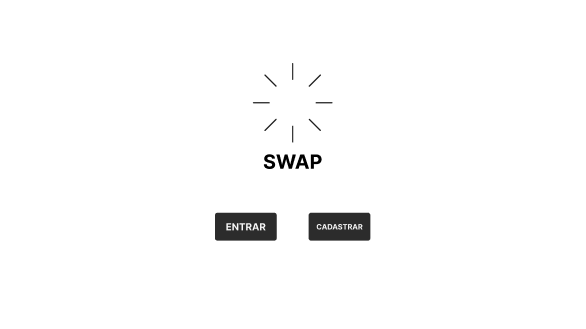
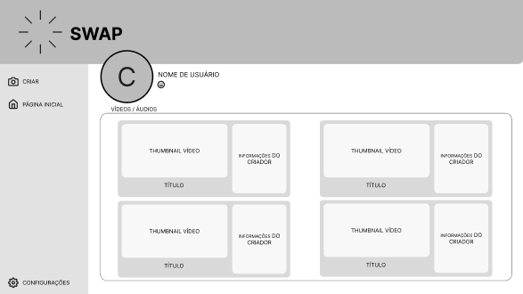
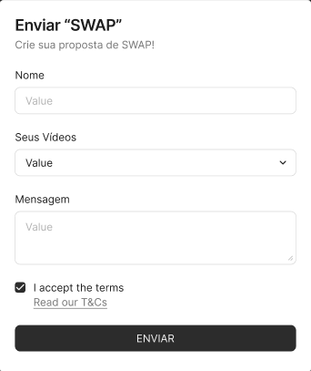

## Introdução

A construção do protótipo de alta fidelidade auxilia a equipe de desenvolvimento a encontrar um nível de detalhes abrangentes, extrair funcionalidades, testar usabilidade, e também fornece uma base para o gerenciamento do projeto pois com o protótipo é possível realizar estimativas de quanto tempo será necessário desempenhar em cada funcionalidade.

## Metodologia

Iniciamos o projeto através dos levantamentos iniciais da equipe, após discussões a ferramenta Figma foi selecionada para produzir o protótipo de alta fidelidade.

## Protótipo de alta fidelidade

### Versão 1.0

### Tela Inicial Sem Logar

### Tela ENTRAR

### Tela CADASTRAR

### Tela INICIAL

### Tela INICIAL COM FILTRO

### Tela PERFIL

### Tela PLAYER

### Tela SWAP

Na primeira versão do protótipo utilizamos a ferramenta FIGMA para a confecção. <a 

## Conclusão

A partir da elaboração do protótipo foi possível ter uma noção inicial da interface do usuário, definindo fluxo, botões, app bars e diversas outras funcionalidades propostas na ideia inicial.

## Referências

> Ferramenta Figma. Disponível em https://www.figma.com

## Autor(es)

| Data     | Versão | Descrição                            | Autor(es)                                                                            |
| -------- | ------- | -------------------------------------- | ------------------------------------------------------------------------------------ |
| 24/11/24 | 1.0     | Criação do documento                 | Matheus Jannotti, Bernardo James, Bernardo Paschoal, Vinicius Mendes e Gabriel Lage 
